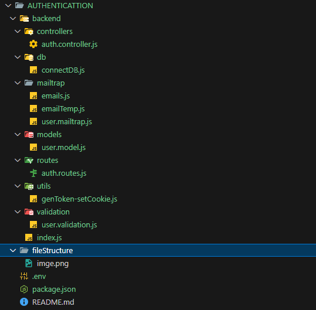

# 🔐 Authentication System with Express.js, MongoDB & Mailtrap

This project is a modular and secure user authentication system built using **Node.js**, **Express**, **MongoDB**, **JWT**, and **Mailtrap** for email handling.

## 📁 Folder Structure



```
AUTHENTICATION/
 ├── backend/
 │   ├── controllers/
 |   |   ├── auth.controllers.js    # Route logic (signup, login, logout) 
 │   ├── db/
 |   |   ├── connectDB.js           # MongoDB connection 
 │   ├── mailtrap/
 |   |   ├── emails.js              # Email templates & sending logic 
 |   |   ├── emailTemp.js
 |   |   ├── user.mailtrap.js
 │   ├── models/               
 |   |   ├── user.model.js          # Mongoose user schema
 │   ├── routes/              
 |   |   ├── auth.routes.js         # Route definitions
 │   ├── utils/                
 |   |   ├── gentToken-setCookie.js # JWT token & cookie handling
 │   ├── validation/          
 |   |   ├── user.validation.js     # User input validation 
 ├── .env                           # Environment variables 
 ├── index.js                       # App entry point 
 ├── package.json                   # Dependencies & scripts
 ├── README.md

```

## 🚀 Features

- User Signup with validation
- Password hashing using `bcryptjs`
- JWT authentication with secure cookies
- Email verification via Mailtrap
- Clean modular folder structure
- Environment-based configuration

## 📦 Technologies Used

- **Node.js** & **Express.js** – Server-side runtime and framework
- **MongoDB** & **Mongoose** – NoSQL database and ODM
- **JWT (jsonwebtoken)** – Token-based authentication
- **bcryptjs** – Secure password hashing
- **dotenv** – Environment variable management
- **Mailtrap** – Email sending & testing
- **HTML Email Templates** – For email verification and password reset

## ⚙️ Setup Instructions

### 1. Clone the Repo

```bash
cd Authentication

2. Install Dependencies

npm install

3. Configure .env

PORT=5000
MONGO_URI=your_mongo_connection_string
JWT_SECRET=your_jwt_secret
MAIL_TOKEN=your_mailtrap_token
MAIL_ENDPOINT=your_mailtrap_endpoint
NODE_ENV=development

4. Run the Server

npm start

🧪 API Endpoints

Method	Endpoint	Description

POST	/api/auth/signup	Register a new user
POST	/api/auth/login	    Log in a user
POST	/api/auth/logout	Log out the user

```
## ✅ Signup Flow

1. User provides name, email, and password.


2. Input is validated.


3. Password is hashed.


4. Verification token is generated.


5. User is saved in MongoDB.


6. Email verification code is sent via Mailtrap.


7. JWT token is generated and set in cookie.


## 📧 Email Templates

Located in: backend/mailtrap/emailTemp.js

Verification Email

Password Reset Email

Password Reset Success


---

## 📂 Important Files Overview

>index.js – Main app setup and middleware

>auth.controller.js – Contains signup/login/logout logic

>connectDB.js – MongoDB connection logic

>user.model.js – Mongoose schema for user

>emails.js / emailTemp.js / user.mailtrap.js – Email content and sending

>user.validation.js – Input validation for name, email, password

>genToken-setCookie.js – JWT generation & secure cookie setup


---

# 🛠 To Do

Add email verification logic using the token

Implement login logic with password comparison

Implement password reset with tokens

Add frontend or Postman collection for testing


👨‍💻 Author

> Developed by Devendra Kumar – feel free to reach out for collaboration!


---

### 📃 License

#### This project is licensed under the MIT License.

---