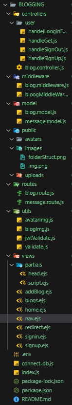

# 📝 Blogging Web App

A full-stack blogging platform built using **Node.js**, **Express**, **MongoDB**, **EJS**, and **Multer** that supports user registration with profile image upload, blog creation, and role-based access (USER and ADMIN). Authenticated users can manage their blogs, while admins have access to all blogs.

---

## 🚀 Features

- 👤 **User Authentication**  
  - Sign Up / Sign In with encrypted passwords  
  - JSON Web Token (JWT) based authentication  
  - Role-based authorization (USER / ADMIN)

- 🖼️ **Profile and Blog Image Uploads**  
  - Profile image upload during signup  
  - Cover image upload for each blog post

- ✍️ **Blog Management**  
  - Add, view, and list blogs  
  - Users can only see their blogs  
  - Admin can see all blogs

- 🧱 **Tech Stack**  
  - **Backend**: Node.js, Express  
  - **Frontend**: EJS templating  
  - **Database**: MongoDB + Mongoose  
  - **File Upload**: Multer  
  - **Security**: bcrypt, JWT, cookie-parser  

---

## 📂 Project Structure



```bash
BLOGGING/
├── controllers/
│   ├── blog.controller.js
│   └── user/
│       ├── handleGet.js
│       ├── handleLoginForm.js
│       ├── handleSignOut.js
│       └── handleSignUp.js
├── middleware/
│   ├── blog.middleware.js
│   └── bloogMiddleWare.js
├── model/
│   ├── blog.model.js
│   └── message.model.js
├── public/
│   ├── avatars/
│   └── images/
│   └── uploads/
├── routes/
│   ├── blog.route.js
│   └── message.route.js
├── utils/
│   ├── avatarImg.js
│   ├── blogImg.js
│   ├── jwtValidate.js
│   └── validate.js 
├── views/
│   ├── addBlog.ejs
│   ├── blogs.ejs
│   ├── home.ejs
│   ├── signin.ejs
│   ├── signup.ejs
│   └── partials/
│       ├── head.ejs
│       └── script.ejs 
├── .env
├── index.js
├── connect-db.js
├── package.json
└── README.md
```

## 🧪 Getting Started
✅ Prerequisites
> Node.js v18+

>MongoDB (running locally or MongoDB Atlas)

## 📦 Installation

```cd BLOGGING```

```npm install```

- Configure environment variables
> .env
>
>PORT=8000
>
>DB_URL=mongodb://127.0.0.1:27017/blog
>
>JWT_KEY=DEVBLOGGING


```npm start ```
>Visit in browser
>
>Navigate to: http://localhost:8000

## 📌 What To Do
After setting up and running the app, here’s how to use it:

1. Sign Up

> Go to  */user/signup*
>
> - Fill in your details and upload a profile picture
>
>- Choose your role: USER or ADMIN

2. Sign In

> Go to */user/signin*
>
>Login using your email and password

3. Add a Blog

> Visit */blog*
>
>Provide title, body, and cover image

4. View Blogs

> /blog/all: View your blogs if you're a USER
>
> /blog/all: Admins can see all blogs from all users

5. Sign Out

> Click on Sign Out in the dropdown menu

## 🔐 Roles
| Role |	Description	| Access |
|------|----------------|--------|
| USER  | 	Default |user role	Can only see own blogs|
| ADMIN	| Elevated access	 | Can view all blogs |

## 🛡️ Validations
Email must be valid (using validator)

Password must be strong (validator.isStrongPassword)

Names must be 3-20 characters and alphanumeric

>Image Uploads: Only .jpg, .jpeg, .png are accepted

## 🛠️ Developer Notes
Blogs and users are linked via createdBy field

JWT token is stored in cookies and verified via middleware

Views rendered using EJS templating engine

>You can expand this project by adding:
>
>Blog editing/deleting
>
>Pagination

## 🤝 Contributing
Feel free to fork this repo and submit a PR with improvements or bug fixes.

## 🧑‍💻 Author
Devendra Kumar

